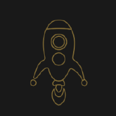

# stAR.

StAR is an Android app that leverages Augmented Reality to let users explore and experience space related content from their phones. Using the device's geolocation, the app requests APIs to show the moon phases, star chart and astronomy image of the day, along with fun facts about space. The star chart model was created using Three JS to be dispalyed via AR. Other amazing 3D models that the user can explore via AR include the Earth, the Moon, Mars, Venus, Jupiter, Hubble Space Telescope and the Curiosity Rover.

### Jet off and see the stars without even having to leave the ground. 

+ Look at your location's star map without needing a telescope.
+ Bring the moon to you with augmented reality.
+ See the astronomy picture of the day with some infomation about it.

## Getting Started:
+ Install Flutter to VSCode
+ Install Android Studio (for computer emulation)
+ Run this command in your terminal

        flutter pub add get
This will add

        get: ^4.6.5

to your `dependencies` in `pubspec.yaml`.

## After being set up:
+ Choose the device that will be emulated 
+ Run this command in your terminal to start the emulation

        flutter run

Note: In your terminal, keyboard shortcuts will be shown for the emulator.

## Software used:
[![VSCode]][VSCode-url]
  [![Android]][Android-url]
  [![Flutter]][Flutter-url]
  [![DART]][DART-url]
  [![ar_flutter]][ar_flutter-url]
  [![Three-JS]][Three-JS-url]
  [![GitHub]][GitHub-url]
  [![Insomnia]][Insmonia-url]

## API:
[![StarMap]][StarMap-url]
  [![NASA]][NASA-url]

## Minimum System Requirements:
+ Android: 12
+ Android SDK: 24
+ AR_flutter_plugin: 0.7.3
+ DART: Between 2.18.5 and 3.0.0
+ Flutter: 3.0.0

## Made possible by
[![Dom]][Dom-url]
  [![Aisha]][Aisha-url]
  [![Sondos]][Sondos-url]
  [![Anwar]][Anwar]
  [![Alice]][Alice-url]

## Credits
This software uses:
- AR sticker: <a href="10 Free vr glasses Stickers for download in SVG, PNG formats | Flaticon" title="vr glasses stickers">Vr glasses stickers created by kerismaker - Flaticon</a>

- Moon phases sticker: <a href="407 Free house Stickers for download in SVG, PNG formats | Flaticon" title="house stickers">House stickers created by Stickers - Flaticon</a>

- Universe sticker: <a href="251 Free planet Stickers for download in SVG, PNG formats | Flaticon" title="planet stickers">Planet stickers created by Stickers - Flaticon</a>

- welcome sticker: <a href="321 Free space Stickers for download in SVG, PNG formats | Flaticon" title="space stickers">Space stickers created by Stickers - Flaticon</a>

- Moon & planets: https://sketchfab.com/minecraftnorge
- Hubble: https://solarsystem.nasa.gov/resources/2383/hubble-space-telescope-3d-model/
- Rover:https://solarsystem.nasa.gov/resources/2398/curiosity-3d-model/

[VSCode-url]: https://code.visualstudio.com/
[VSCode]: https://img.shields.io/badge/IDE-VS%20Code-blue
[Android-url]: https://developer.android.com/studio
[Android]: https://img.shields.io/badge/Emulation-Android%20Studio-brightgreen
[DART-url]: https://dart.dev/
[DART]: https://img.shields.io/badge/Programming-Dart-blue
[Flutter-url]: https://flutter.dev/
[Flutter]: https://img.shields.io/badge/UI-Flutter-blue
[ar_flutter-url]: https://pub.dev/packages/ar_flutter_plugin
[ar_flutter]: https://img.shields.io/badge/AR-ar__flutter__plugin-orange
[Insmonia-url]: https://insomnia.rest/
[Insomnia]: https://img.shields.io/badge/API%20testing-Insomnia-blueviolet
[Three-JS]:https://img.shields.io/badge/3D-Three%20JS-yellow
[Three-JS-url]:https://threejs.org/
[GitHub]:https://img.shields.io/badge/Models%20Storage-GitHub-lightgrey
[Github-url]: https://github.com/

[StarMap-url]: https://docs.astronomyapi.com/endpoints/studio/star-chart
[StarMap]: https://img.shields.io/badge/StarMap-AstronomyAPI-black
[NASA-url]: https://api.nasa.gov/
[NASA]: https://img.shields.io/badge/Star%20Facts-NASA%20API-navy

[Dom-url]: https://github.com/BaiDom
[Dom]: https://img.shields.io/badge/Cosmic%20Janitor-Dom%20Baily-blueviolet?style=for-the-badge
[Sondos-url]: https://github.com/sondos-ahmed
[Sondos]: https://img.shields.io/badge/Detective-Sondos%20Bettamer-teal?style=for-the-badge
[Aisha-url]: https://github.com/rivendellf
[Aisha]: https://img.shields.io/badge/Stargirl-Aisha%20Hamid-critical?style=for-the-badge
[Anwar-url]: https://github.com/inc-cat
[Anwar]: https://img.shields.io/badge/Chef-Anwar%20Louis-black?style=for-the-badge
[Alice-url]: https://github.com/captainread
[Alice]: https://img.shields.io/badge/Captain-Alice%20Read-pink?style=for-the-badge

2022/2023
